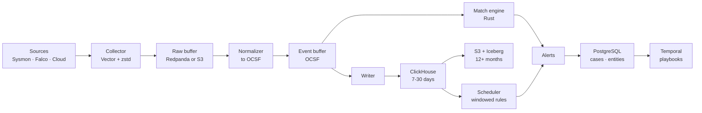

# Goliath

[](https://github.com/arelove/goliath-siem/actions/workflows/ci.yml)
[](https://github.com/arelove/goliath-siem/actions/workflows/bench.yml)
[](LICENSE)
[](Cargo.toml)

An open security data platform: event ingestion, detection, response
orchestration, and incident handling in one system.

> **Status: pre-alpha.** Nothing here is production-ready. The architecture is
> settled and documented, and the Sigma detection path works end to end on
> OCSF events. Ingestion, storage, and the platform around them are not built
> yet.

Other languages: [Русский](README_ru.md)

## What works today

The first milestone is the detection engine, built to be useful on its own,
and the second has started with normalization. A raw Sysmon event and a Sigma
rule already meet in a match:

| Step | Crate |
| --- | --- |
| Normalize raw Sysmon events to OCSF through a declarative source definition, dropping nothing | [`goliath-normalize`](https://crates.io/crates/goliath-normalize) |
| Parse Sigma rules, treating the YAML as untrusted input | [`goliath-sigma`](https://crates.io/crates/goliath-sigma) |
| Resolve Sigma fields to OCSF paths through versioned mappings | [`goliath-rule`](https://crates.io/crates/goliath-rule) |
| Evaluate thousands of rules against each event, sharing the work between them | [`goliath-match`](https://crates.io/crates/goliath-match) |

All of them share the OCSF types of [`goliath-ocsf`](https://crates.io/crates/goliath-ocsf).
Each crate is published on crates.io and usable without the rest of the
platform; API documentation is on [docs.rs](https://docs.rs/goliath-match).

Measured against the whole [SigmaHQ](https://github.com/SigmaHQ/sigma)
repository, with details and reproduction steps in
[docs/sigma-coverage.md](docs/sigma-coverage.md):

- all 3,757 rules parse;
- 2,046 of 2,047 rules for the five Windows log sources mapped so far load:
  process creation, file creation, image loads, network connections, and
  registry value sets;
- all 357 SigmaHQ regression cases for loaded rules fire exactly as SigmaHQ
  expects on real recorded attack events;
- the engine evaluates those 2,046 rules at about 129,000 events/s on one
  core, and returns exactly what a deliberately naive reference evaluator
  returns on every event;
- one engine shared by every thread of a 16-core laptop evaluates about
  2,000,000 events/s, past the 1,000,000 events/s target for detection.

The engine's speed is guarded in CI: a pull request fails if evaluating an
event allocates, or if the engine spends more than 2% more instructions on a
fixed workload. See [docs/benchmarks.md](docs/benchmarks.md).

Not built yet: ingestion, storage, scheduled detection, response, and the
interface. The order is in [docs/roadmap.md](docs/roadmap.md).

## Run it

The platform as it stands, Sysmon files in, OCSF events in ClickHouse out, in
two containers:

```text
cp .env.example .env          # set CLICKHOUSE_PASSWORD
docker compose up -d --build
```

Drop Sysmon events, as `evtx_dump -o json` writes them, into `inbox/sysmon/`,
and query them by any OCSF path:

```sql
SELECT time, event.process.cmd_line FROM goliath.events WHERE class_uid = 1007
```

The password stays in `.env`, which git ignores, and reaches goliath as a
mounted secret file, not an environment variable. `scripts/compose-smoke.sh`
does all of this end to end, and runs in CI.

## Try it

```text
git clone https://github.com/arelove/goliath-siem.git
cd goliath-siem
cargo test --workspace

# Every SigmaHQ regression case, end to end, with the engine timed:
git clone --depth 1 https://github.com/SigmaHQ/sigma.git
cargo run --release -p goliath-match --example sigma_regression -- \
    sigma crates/goliath-rule/mappings/sigma-windows.yaml
```

As a library, a rule goes from Sigma YAML to matches in four calls:

```rust
let rule = goliath_sigma::parse_rule(&yaml)?;
let mappings = goliath_rule::MappingSet::from_yaml(&mapping_yaml)?;
let resolved = goliath_rule::sigma::resolve(&rule, &mappings)?;
let engine = goliath_match::Engine::new(vec![resolved])?;

let matched: Vec<usize> = engine.matches(&ocsf_event);
```

For a stream, keep one `Scratch` from `engine.scratch()` and call
`engine.matches_into`, which does not allocate once warmed up.

## Why another SIEM

We do not compete on feature count. Splunk, Elastic Security, and Wazuh all
work. We compete on four things they structurally cannot match:

**Your data stays yours.** Cold storage is Parquet/Iceberg in your own bucket.
Leaving the platform requires no export, because there is nothing to export
from - the open format *is* the storage.

**Detections are code.** Every rule ships with tests that run in CI against
labelled attack telemetry. A rule cannot merge without proof that it fires.

**Built for the volume you actually have.** Target is 1,000,000 events/second
with thousands of concurrently evaluated rules. The matching engine is the
core of the project, not an afterthought behind a search bar.

**You choose the shape.** Collectors, normalizers, detectors, and the API are
roles, not products. Run them as one binary on a laptop or as separate fleets
across regions - same code, different composition.

## Design targets

| Metric | Target |
| --- | --- |
| Throughput | 1,000,000 events/s (~500 MB/s, ~43 TB/day raw) |
| On-disk volume | ~2.9 TB/day at ~15x compression |
| Hot retention | 7-30 days, interactive search |
| Cold retention | 12+ months, open format |
| Streaming detection latency | p99 < 5 s |
| Scheduled detection latency | p99 < 5 min |
| Cold start | < 1 minute, single binary, no Kubernetes |

## Architecture



Full reasoning lives in [docs/architecture.md](docs/architecture.md), and every
significant decision has an ADR in [docs/adr/](docs/adr/).

## Documentation

| Document | Contents |
| --- | --- |
| [docs/architecture.md](docs/architecture.md) | Targets, data flow, component map, benchmark method |
| [docs/roadmap.md](docs/roadmap.md) | Delivery plan and current milestone |
| [docs/sigma-coverage.md](docs/sigma-coverage.md) | How much of SigmaHQ loads and fires on real attacks, and how fast |
| [docs/benchmarks.md](docs/benchmarks.md) | How speed is measured, and how CI stops regressions |
| [docs/adr/](docs/adr/) | Architecture decision records |
| [CONTRIBUTING.md](CONTRIBUTING.md) | Invariants, review rules, how to add a decision |
| [SECURITY.md](SECURITY.md) | How to report a vulnerability |

## License

Copyright 2026 arelove. Development began on 2026-09-21.

Licensed under the [Apache License 2.0](LICENSE); see [NOTICE](NOTICE)
for attributions.
