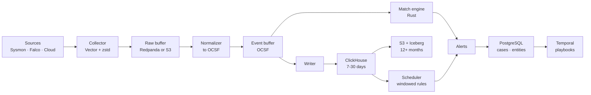

# Goliath

An open security data platform: event ingestion, detection, response
orchestration, and incident handling in one system.

> **Status: pre-alpha.** Nothing here is production-ready. The architecture is
> settled and documented, and the Sigma detection path works end to end on
> OCSF events. Ingestion, storage, and the platform around them are not built
> yet.

Other languages: [Русский](README_ru.md)

## What works today

The first milestone is the detection engine, built to be useful on its own.
A Sigma rule already goes from YAML to a match on an OCSF event:

| Step | Crate |
| --- | --- |
| Parse Sigma rules, treating the YAML as untrusted input | `goliath-sigma` |
| Resolve Sigma fields to OCSF paths through versioned mappings | `goliath-rule` |
| Evaluate a resolved rule against an event | `goliath-match` |

Measured against the whole [SigmaHQ](https://github.com/SigmaHQ/sigma)
repository, with details and reproduction steps in
[docs/sigma-coverage.md](docs/sigma-coverage.md):

- all 3,757 rules parse;
- 2,046 of 2,047 rules for the five Windows log sources mapped so far load:
  process creation, file creation, image loads, network connections, and
  registry value sets;
- all 357 SigmaHQ regression cases for loaded rules fire exactly as SigmaHQ
  expects on real recorded attack events.

Not built yet: the fast engine that shares work across thousands of rules,
ingestion, storage, and the interface. The order is in
[docs/roadmap.md](docs/roadmap.md).

## Why another SIEM

We do not compete on feature count. Splunk, Elastic Security, and Wazuh all
work. We compete on four things they structurally cannot match:

**Your data stays yours.** Cold storage is Parquet/Iceberg in your own bucket.
Leaving the platform requires no export, because there is nothing to export
from - the open format *is* the storage.

**Detections are code.** Every rule ships with tests that run in CI against
labelled attack telemetry. A rule cannot merge without proof that it fires.

**Built for the volume you actually have.** Target is 1,000,000 events/second
with thousands of concurrently evaluated rules. The matching engine is the
core of the project, not an afterthought behind a search bar.

**You choose the shape.** Collectors, normalizers, detectors, and the API are
roles, not products. Run them as one binary on a laptop or as separate fleets
across regions - same code, different composition.

## Design targets

| Metric | Target |
| --- | --- |
| Throughput | 1,000,000 events/s (~500 MB/s, ~43 TB/day raw) |
| On-disk volume | ~2.9 TB/day at ~15x compression |
| Hot retention | 7-30 days, interactive search |
| Cold retention | 12+ months, open format |
| Streaming detection latency | p99 < 5 s |
| Scheduled detection latency | p99 < 5 min |
| Cold start | < 1 minute, single binary, no Kubernetes |

## Architecture

Full reasoning lives in [docs/architecture.md](docs/architecture.md), and every
significant decision has an ADR in [docs/adr/](docs/adr/).

## Documentation

| Document | Contents |
| --- | --- |
| [docs/architecture.md](docs/architecture.md) | Targets, data flow, component map, benchmark method |
| [docs/roadmap.md](docs/roadmap.md) | Delivery plan and current milestone |
| [docs/sigma-coverage.md](docs/sigma-coverage.md) | How much of SigmaHQ loads and fires on real attacks |
| [docs/adr/](docs/adr/) | Architecture decision records |
| [CONTRIBUTING.md](CONTRIBUTING.md) | Invariants, review rules, how to add a decision |

## License

[Apache License 2.0](LICENSE).
