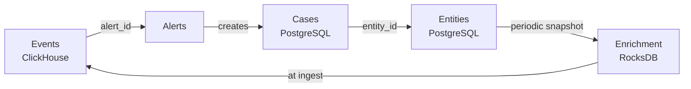

# 0003. Data boundary

- **Status:** Accepted
- **Date:** 2026-09-21

## Context

The system holds two fundamentally different classes of data in different
engines ([ADR-0002](0002-storage-stack.md)). Without an explicit invariant the
boundary erodes, and within months the system drowns in asynchronous mutations.

## Decision

**ClickHouse is the source of truth for events. PostgreSQL is the source of
truth for state. Events are never updated. State is never bulk-scanned.**

| Property | Events | State |
| --- | --- | --- |
| Mutability | Immutable | Mutable |
| Volume | Trillions of rows | Millions of rows |
| Access pattern | Bulk scan | Point lookup by key |
| Guarantees | At-least-once plus dedup | ACID |
| Deletion | TTL, whole partitions only | Ordinary DELETE |

## How the layers connect

By identifier only. No distributed transactions, and no cross-engine joins on
the hot path.

Entities reach the hot path not through a PostgreSQL query but through a
periodic snapshot into each node's local RocksDB. The consequence is accepted
deliberately: **enrichment operates on data stale by up to one refresh
interval** (target: 30 seconds). That is the price of having no network call
per event, and it is worth paying.

## Rejected at review

- Any `ALTER ... UPDATE` against ClickHouse outside a migration.
- Case status, assignment, or comments stored in ClickHouse.
- A PostgreSQL query issued from code that runs per event.
- A full scan of the entity table serving a UI request.

## When to revisit

A requirement appears for transactional consistency between an event and state,
such as legally significant acknowledgement of receipt. That calls for a
separate ADR on the outbox pattern, not for blurring this boundary.
