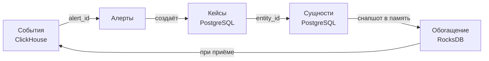

# 0003. Граница данных

- **Статус:** Принято
- **Дата:** 2026-09-21

## Контекст

Система держит два принципиально разных класса данных в разных движках
([ADR-0002](0002-storage-stack.md)). Без явного инварианта границу размывают, и
через полгода система тонет в асинхронных мутациях.

## Решение

**ClickHouse — источник истины для событий. PostgreSQL — источник истины для
состояния. События никогда не обновляются. Состояние никогда не сканируется
массово.**

Инвариант идёт в `CONTRIBUTING.md` и проверяется на ревью.

| Свойство | События | Состояние |
| --- | --- | --- |
| Изменяемость | Иммутабельны | Мутабельно |
| Объём | Триллионы строк | Миллионы строк |
| Доступ | Массовый скан | Точечный по ключу |
| Гарантии | At-least-once + дедуп | ACID |
| Удаление | Только по TTL целыми партициями | Обычный DELETE |

## Как слои связаны

Связь только по идентификаторам, без распределённых транзакций и без JOIN между
движками на горячем пути.

Сущности попадают в горячий путь не запросом в Postgres, а периодическим
снапшотом в локальный RocksDB каждой ноды. Следствие, которое принимаем
осознанно: **обогащение работает на данных, отстающих на интервал обновления**
(цель — 30 секунд). Это цена за отсутствие сетевого вызова на событие.

## Запрещено код-ревью

- Любой `ALTER ... UPDATE` в ClickHouse вне миграций.
- Хранение статусов, назначений и комментариев в ClickHouse.
- Запрос в PostgreSQL из кода, исполняющегося на каждое событие.
- Полный скан таблицы сущностей в запросе к UI.

## Когда пересмотреть

Появится требование транзакционной согласованности между событием и состоянием
(например, юридически значимое подтверждение приёма). Тогда — отдельный ADR о
паттерне outbox, а не размытие границы.
