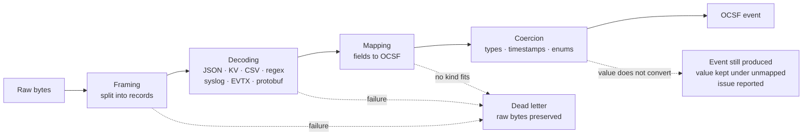

# 0007. Source and parser model

- **Status:** Accepted
- **Date:** 2026-09-21
- **Amended:** 2026-09-25, conversion failures no longer dead-letter the
  record; fixtures run under `cargo test`; definitions are checked against
  the OCSF schema when they load. 2026-09-26, framing may assemble one
  record from several lines, as Linux audit events need

## Context

Onboarding a new log source is the most frequent task an operator performs and
the largest accumulated asset of every incumbent SIEM. It must be doable
without writing Rust, without forking, and without waiting for us.

## Decision

A **source definition** is a declarative, versioned, testable artifact
composed of four stages. It compiles to a plan
([ADR-0004](0004-configuration-and-extensibility.md)) and ships with its own
test fixtures.

## Stages

**Framing** splits a byte stream into records: newline-delimited, length-prefixed,
multiline with a start pattern, or a container format such as EVTX. A record
may also be assembled from lines that are not adjacent: Linux audit writes
one event as several lines sharing an event identifier, and framing gathers
them, so that mapping sees the event whole. A line that names no event is a
framing dead letter.

**Decoding** turns a record into a field map. Built-in decoders cover JSON,
key-value, CSV, regex with named captures, grok patterns, syslog RFC 3164 and
RFC 5424, Windows EVTX, and protobuf. A source needing anything else supplies a
WASM decoder.

**Mapping** assigns decoded fields to OCSF paths declaratively. This is where
source-specific knowledge lives, and it is the part operators most often edit.

**Coercion** normalizes types: timestamp formats and time zones, IP parsing,
enum translation to OCSF values, unit conversion. Translation tables are
checked against the attribute's enumeration when the definition loads, and a
value a table does not list is kept and reported like any other value that
does not convert, unless the table names what such values become.

## Data is never dropped

A record that cannot become an event, because it cannot be framed, decoded, or
matched to a kind of the source, goes to a **dead letter stream with its raw
bytes intact**, tagged with the stage, the source version, and the error.
Failures are counted per source and surfaced as an operational metric.

A value that does not convert is different, and does not send its record to
the dead letter stream. The event is produced without that attribute, the
value is kept as written under `unmapped`, and the failure is reported with the
event as an issue. Dead-lettering the whole record would keep it away from
detection, and would give an attacker a way to hide an event from every rule:
write one field the parser cannot convert.

This is non-negotiable. A SIEM that silently discards what it cannot parse
loses the evidence precisely when an attacker uses an unusual code path.
Reprocessing the dead letter stream after fixing a source definition is a
supported operation.

## Testing

Every source definition ships with fixtures: sample raw records and their
expected OCSF output, including the dead letters and issues they must produce.
`cargo test` runs them in seconds without infrastructure, and checks every
cleanly converted event against the OCSF invariants. A source definition
without fixtures does not merge.

A definition is also checked against the OCSF schema when it loads, before
any record: its classes and activities must exist, every target must be an
attribute of the class and not inside an array, and a constant or conversion
must produce what the attribute holds. A misspelled target would otherwise
produce events that load, store, and are never read by any rule, which no
fixture written by the same author would notice.

This makes source definitions contributable by people who do not write Rust,
which is the only way the parser library ever reaches useful size.

## Versioning and determinism

Source definitions are versioned. Parsing is deterministic: the same raw bytes
under the same source version always produce the same OCSF event. Every stored
event records the source definition version that produced it, so a parsing bug
can be identified and the affected range reprocessed.

## Options considered

| Option | For | Against | Verdict |
| --- | --- | --- | --- |
| Declarative stages plus WASM escape hatch | Contributable without Rust, testable, compiles to a fast plan | Declarative mapping cannot express everything; needs an escape hatch | **Accepted** |
| Code-only parsers in Rust | Maximum flexibility and speed | Excludes most contributors; every source needs a release | No |
| Embedded scripting language | Flexible, no recompile | Slow on the hot path, unsafe, another language to learn | No - WASM covers this safely |

## Consequences

- We own a decoder library and must keep it fast; decoders are on the hot path.
- Dead letter storage consumes capacity and needs its own retention policy.
- The OCSF mapping surface must be discoverable, or operators will guess. This
  requires schema-driven tooling, not just documentation. The first piece is
  the compiled-in schema in `goliath-ocsf`, which names the exact attribute and
  object where a path goes wrong.

## When to revisit

More than roughly 30% of community source definitions require a WASM decoder,
indicating the declarative decoders are too weak and need extending.
