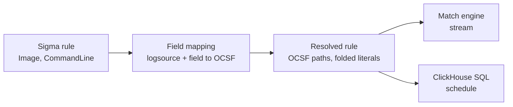

# 0012. Sigma fields resolve to OCSF paths at load time

- **Status:** Accepted
- **Date:** 2026-09-23

## Context

Sigma rules name fields the way the source names them: `Image`,
`CommandLine`, `ParentImage` for Sysmon process creation. Goliath stores and
evaluates OCSF events ([ADR-0007](0007-source-and-parser-model.md)), where the
same facts live at `process.file.path`, `process.cmd_line`, and
`process.parent_process.file.path`. A rule evaluated against an OCSF event
without translation references fields that do not exist, and a missing field
never matches, so every rule would load cleanly and never fire.

Two more facts constrain the design:

- **Case.** The Sigma specification makes string comparison case insensitive
  unless the `cased` modifier is present. Rules rely on it: `Image` values are
  written in whatever case the author's sample happened to have.
- **Two execution paths.** The same rule runs in the Rust match engine on the
  stream and as ClickHouse SQL on the schedule
  ([architecture.md](../architecture.md)). A rule that fires on one path and
  not the other for the same event is a defect nobody can diagnose from an
  alert.

pySigma solves the first problem with processing pipelines: imperative Python
transformations applied to a rule before a backend sees it.

## Decision

**A field mapping is a declarative, versioned artifact that resolves every
Sigma field reference to OCSF paths once, when a rule loads. Both execution
paths consume the resolved rule, never the original field names.**



## The mapping

A mapping is selected by the rule's `logsource` and contributes two things.

**A class condition.** `category: process_creation` with `product: windows`
becomes `class_uid = 1007` (Process Activity), `activity_id = 1` (Launch), and
`device.os.type_id = 100` (Windows), added as an implicit conjunct. The rule's
own detection is not consulted to decide which events it applies to.

**Field paths.** Each Sigma field maps to one or more OCSF paths:

```yaml
logsource: { category: process_creation, product: windows }
class: { class_uid: 1007, activity_id: 1, device.os.type_id: 100 }
fields:
  Image: process.file.path
  CommandLine: process.cmd_line
  ParentImage: process.parent_process.file.path
  User: [actor.user.name, process.user.name]
```

A field mapped to several paths matches when any of them does. That is the
same meaning as a Sigma value list, so it adds no new semantics.

Mappings ship as data with fixtures, the same way source definitions do: a
Sigma rule, an OCSF event, and whether the rule must match it. A mapping
without fixtures does not merge.

## Unmapped fields reject the rule

A field reference with no mapping for the rule's log source fails to load with
an error naming the field. It is not evaluated as "absent".

Loading it would reproduce the exact failure this decision exists to prevent:
a rule that is present in the console and silently never fires. The refusal is
also coverage data. An unmapped field is a detection the operator believes they
have and do not, which is what
[ADR-0009](0009-attack-knowledge-model.md) calls the difference between
coverage and capability.

A mapping may map a field to `unmapped.<name>` explicitly, for sources whose
normalizer keeps the original field there. That is a declared choice, never a
fallback.

## Case folding

Case insensitive comparison uses **Unicode simple case folding**: a fixed,
locale independent, per code point mapping. Full folding, where one character
can become two, is not used; neither is any locale's lowercase rule, because a
rule must not match differently on a Turkish server.

Folding happens in two places and in one implementation:

- **Rule literals are folded at load time**, so the resolved rule carries
  folded values and the `cased` flag per predicate.
- **Event values are folded once per field per event** on the stream, and the
  folded value is shared by every rule that reads that field.

The ClickHouse path must produce identical results. Its built-in lowercase
functions are not guaranteed to agree with our folding on every code point, so
agreement is established by a differential test that runs every shipped rule
through both paths over a corpus containing non-ASCII text. If a function
disagrees, the fallback is a folded column written at ingest by our own code,
so that one implementation folds for both paths.

## Options considered

| Option | For | Against | Verdict |
| --- | --- | --- | --- |
| Declarative mapping resolved at load time | One resolution feeds both paths; per-event cost is zero; testable with fixtures | A mapping must exist before a rule is usable | **Accepted** |
| Normalizer also emits Sigma field names | Rules run unchanged | Doubles stored fields; ties storage to one rule language; ambiguous across sources | No |
| Translate field names per event | No load-time step | Cost paid a million times a second for work that never changes | No |
| pySigma pipelines | Existing ecosystem | Python on the load path; imperative, so not inspectable or diffable | No, but mappings should be importable from them |

## Consequences

- The match engine and the SQL compiler never see Sigma field names. Neither
  needs to know that Sigma exists beyond the condition structure.
- Rule loading needs the mapping set, so rules and mappings are versioned
  together, and every alert records the mapping version that resolved its rule.
- The first user of a rule for a log source we have not mapped gets a load
  error, not a silently dead rule. That is deliberate and will be reported as
  friction.
- Case folding appears in the per-event cost. It is paid once per field rather
  than once per rule, which is what keeps it affordable at thousands of rules.

## When to revisit

- More than 20% of rules in the upstream SigmaHQ repository for a mapped log
  source fail to load for unmapped fields, meaning the mapping set is too thin
  to be the default.
- The differential test shows the ClickHouse path needing the folded-column
  fallback for more than a handful of fields, in which case folding at ingest
  becomes the default for every string field rules reference.
