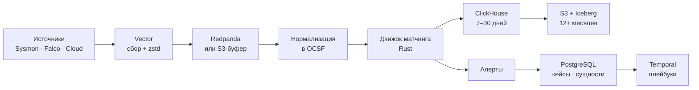

# Архитектура

Открытая платформа безопасности: приём событий, детект, оркестрация
реагирования и работа с инцидентами в одной системе. Конкурируем не функциями,
а экономикой владения и открытостью формата хранения.

## Целевые показатели

| Показатель | Цель | Комментарий |
| --- | --- | --- |
| Пропускная способность | 1 000 000 событий/с | ~500 МБ/с, ~43 ТБ/сут в сыром виде |
| Объём на диске | ~2.9 ТБ/сут | при сжатии ~15x |
| Горячее хранение | 7–30 дней | интерактивный поиск |
| Холодное хранение | 12+ месяцев | открытый формат в бакете клиента |
| Латентность стримингового детекта | p99 < 5 с | высокоприоритетные правила |
| Латентность отложенного детекта | p99 < 5 мин | длинный хвост правил |
| Старт с нуля | < 1 минуты | один бинарь, без Kubernetes |
| Стоимость владения | на порядок ниже ingest-лицензий | основной аргумент внедрения |

Чем берём рынок, на котором уже есть Splunk, Elastic Security и Wazuh:

1. **Данные остаются у клиента** в Parquet/Iceberg в его бакете. Уход с
   платформы не требует экспорта.
2. **Детекты как код** с юнит-тестами в CI — правило нельзя влить без
   доказательства срабатывания.
3. **Движок матчинга**, рассчитанный на тысячи правил при миллионе событий в
   секунду.
4. **Простота развёртывания** как конкурентное свойство, а не как удобство.

Чем заведомо не берём: объёмом готового контента, числом парсеров и
сертификациями. Это накопительные активы, они появятся годами позже.

## Поток данных

Решения по хранению — [ADR-0002](adr/0002-storage-stack.md), граница между
слоями — [ADR-0003](adr/0003-data-boundary.md).

## Карта компонентов

| Крейт / пакет | Язык | Публикуемый | Контейнер |
| --- | --- | --- | --- |
| `ocsf-schema` | Rust | crates.io | — (библиотека) |
| `sigma-parser` | Rust | crates.io | — |
| `sigma-clickhouse` | Rust | crates.io | — |
| `match-engine` | Rust | crates.io | `detector` |
| `enrich` | Rust | crates.io | внутри `detector` |
| `normalizer` | Rust | — | `normalizer` |
| `control-plane` | Go | — | `api` |
| `case-service` | Go | — | `cases` |
| `playbooks` | Python | — | `worker` |
| `detection-content` | Python | PyPI | CI |
| `ui` | TypeScript | — | `ui` |

Языки и правило границы — [ADR-0005](adr/0005-languages-and-process-boundaries.md).

### Режим одного бинаря

Каждый контейнер обязан собираться в единый процесс с встраиваемыми заменами:
ClickHouse → DuckDB, PostgreSQL → SQLite, Valkey выключен, Redpanda → локальная
очередь на диске. Цель — `docker run` даёт работающую систему меньше чем за
минуту. Без этого до продакшена дойдут единицы: сложность развёртывания —
главный барьер принятия OSS-систем такого класса.

## Где размещено узкое место

Узкое место есть у любой системы по определению — это самый медленный ресурс.
Инженерная задача не в том, чтобы его устранить, а в том, чтобы выбрать, где
он находится.

| Слой | Узкое место выбрано | Почему приемлемо |
| --- | --- | --- |
| Приём | Пропускная способность диска | Масштабируется шардами линейно |
| Горячий путь детекта | CPU на матчинге | Прямая цель оптимизации; измеряем в событиях/с на ядро |
| Отложенный детект | Латентность до 5 минут | Осознанный обмен латентности на простоту эксплуатации |
| Обогащение | Отставание снапшота до 30 с | Цена за отсутствие сетевого вызова на событие |
| Холодный запрос | Пропускная способность S3 | Редкая операция, оптимизируется партиционированием |

## Методика бенчмарка

Два разных потока данных, которые нельзя смешивать.

**Поток A — объём.** Синтетический генератор на модели сущностей: N
пользователей, M хостов, суточные циклы, Zipf по активности. Критичное
требование: одна и та же сущность порождается с разными идентификаторами в
разных источниках, иначе слою entity resolution нечего склеивать.

**Поток B — достоверность.** Реальные размеченные датасеты и телеметрия,
полученная запуском Atomic Red Team и CALDERA на собственных стендах.

| Источник | Что даёт |
| --- | --- |
| OTRF Security-Datasets | Телеметрия атак, размечено по ATT&CK |
| Atomic Red Team | Собственная подлинная телеметрия под свои правила |
| MITRE CALDERA | Компаундные сценарии, не одиночные техники |
| LANL Cyber Dataset | 58 дней auth/proc/flow/DNS с размеченным redteam |
| Loghub (LogPAI) | Реальная структура и объём для нагрузки |
| Собственный ханипот | Подлинный враждебный трафик |

Инжектор вкрапляет размеченные цепочки в benign-поток на известных offset'ах.
Это даёт ground truth, по которому меряются precision и recall движка детекта.

Что меряем и публикуем в каждом релизе:

- события/с на ядро при N правилах (N = 100, 1000, 3000);
- p50/p95/p99 латентности от приёма до алерта;
- коэффициент сжатия на каждом типе источника;
- precision/recall на размеченном наборе;
- потребление памяти на ноду при 10⁶ и 10⁸ индикаторов IOC.

На синтетике нельзя мерить precision/recall. На реальных датасетах нельзя
мерить throughput. Смешение этих двух измерений — методологическая ошибка,
которую отлавливаем на ревью.

## Стратегия выхода

**Не выпускаем «платформу v1.0, которая заменяет Splunk».** Никто не мигрирует
SIEM целиком на проект без истории: риск для компании несопоставим с выгодой.
Результат такого запуска — звёзды на GitHub и ноль продакшен-инсталляций.

Выпускаем клин — узкий компонент, полезный сам по себе, который ставится рядом
с существующей системой и не требует ничего выкидывать.

| Кандидат | Дифференциация | Кривая принятия |
| --- | --- | --- |
| Движок детектов (Sigma-native, ClickHouse-native) | Максимальная | Средняя |
| Слой нормализации в OCSF | Низкая | Максимальная |
| Security data lake на ClickHouse | Средняя | Высокая — дополняет, а не вытесняет |

Выбранный порядок: движок → хранилище → платформа собирается из работающих
частей, у каждой из которых уже есть пользователи.

## Открытые вопросы

- Лицензия проекта: Apache 2.0 против AGPL. Влияет на корпоративное внедрение
  и на возможность коммерциализации. Решить до первого публичного коммита.
- Буфер: Redpanda против S3-буфера. При 500 МБ/с кросс-AZ трафик в облаке
  становится значимой статьёй расходов; нужен расчёт под целевой профиль
  развёртывания.
- Stateful-корреляция: Flink против собственного движка на RocksDB. Решать
  после замера доли правил, которым действительно нужны последовательности.
