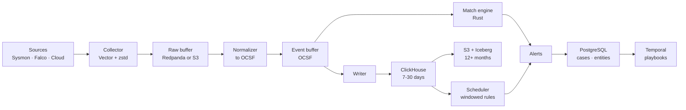

# Architecture

Goliath is an open security data platform: event ingestion, detection, response
orchestration, and incident handling in one system. We compete on cost of
ownership and on openness of the storage format, not on feature count.

## Design targets

| Metric | Target | Note |
| --- | --- | --- |
| Throughput | 1,000,000 events/s | per cluster, ~500 MB/s, ~43 TB/day raw |
| On-disk volume | ~2.9 TB/day | at ~15x compression |
| Hot retention | 7-30 days | interactive search |
| Cold retention | 12+ months | open format in the customer's bucket |
| Streaming detection latency | p99 < 5 s | high-priority rules |
| Scheduled detection latency | p99 < 5 min | the long tail of rules |
| Cold start | < 1 minute | single binary, no Kubernetes |
| Cost of ownership | an order of magnitude below ingest licensing | the primary adoption argument |

A cluster-wide rate says nothing without the hardware behind it. The measured
quantity is events/s per core at a stated rule count; the cluster target
follows from it and the node count. Every published figure names the CPU, core
count, memory, and rule set it was measured with.

How we take a market that already has Splunk, Elastic Security, and Wazuh:

1. **Customer data stays with the customer** in Parquet/Iceberg in their own
   bucket. Leaving the platform requires no export.
2. **Detections are code** with unit tests in CI. A rule cannot merge without
   proof that it fires.
3. **A matching engine** built for thousands of rules at a million events per
   second.
4. **Deployment simplicity** treated as a competitive property, not a
   convenience.

What we explicitly do not compete on: volume of bundled content, number of
parsers, and certifications. Those are accumulated assets that arrive years
later.

## Data flow

Storage and detection read the event buffer independently. The detector is
never in the write path: a slow rule, a bad hot reload, or a crashed detector
delays alerts but never stops events from being stored. Once the detector
recovers, it resumes from its own offset in the buffer, so no event goes
unevaluated.

Storage decisions are in [ADR-0002](adr/0002-storage-stack.md); the boundary
between layers is [ADR-0003](adr/0003-data-boundary.md).

## Composition

The diagram above shows a flow, not a deployment. Components are roles that
compose: one binary can host any subset of them, and where each runs is
configuration. A laptop runs all roles in one process; a bank runs collectors
in branches, normalization in a regional DMZ, and detection centrally. Same
code, different composition. See [ADR-0006](adr/0006-deployment-topology.md).

### Single-binary mode

Every container must also build into a single process with embedded
substitutes: ClickHouse becomes DuckDB, PostgreSQL becomes SQLite, Valkey is
disabled, Redpanda becomes a local on-disk queue. The target is that
`docker run` produces a working system in under a minute.

Without this, few deployments ever reach production: deployment complexity is
the dominant barrier to adoption for open-source systems of this class.

## Component map

| Crate or package | Language | Published | Container |
| --- | --- | --- | --- |
| `goliath-ocsf` | Rust | crates.io | library |
| `goliath-sigma` | Rust | crates.io | library |
| `goliath-rule` | Rust | crates.io | library |
| `goliath-sigma-clickhouse` | Rust | crates.io | library |
| `goliath-match` | Rust | crates.io | `detector` |
| `goliath-enrich` | Rust | crates.io | inside `detector` |
| `goliath-intel` | Rust | crates.io | inside `detector` |
| `goliath-attack` | Rust | crates.io | inside `api` |
| `goliath-pipe` | Rust | - | shared transport |
| `goliath-normalize` | Rust | crates.io | `normalizer` |
| `goliath-store` | Rust | - | `writer` |
| `control-plane` | Go | - | `api` |
| `case-service` | Go | - | `cases` |
| `playbooks` | Python | - | `worker` |
| `detection-content` | Python | PyPI | CI |
| `ui` | TypeScript | - | `ui` |

Language choices and the process boundary rule are in
[ADR-0005](adr/0005-languages-and-process-boundaries.md).

## Where the bottleneck is placed

Every system has a bottleneck by definition: it is the slowest resource. The
engineering task is not to eliminate it but to choose where it sits.

| Layer | Chosen bottleneck | Why acceptable |
| --- | --- | --- |
| Ingestion | Disk throughput | Scales linearly with shards |
| Streaming detection | CPU in the match engine | The direct optimization target; measured in events/s per core |
| Scheduled detection | Latency up to 5 minutes | Deliberate trade of latency for operational simplicity |
| Enrichment | Snapshot staleness up to 30 s | The price of having no network call per event |
| Cold queries | S3 throughput | Rare operation, addressed by partitioning |

## Benchmark method

Two distinct data streams that must never be mixed.

**Stream A, volume.** A synthetic generator driven by an entity model: N users,
M hosts, daily cycles, Zipf-distributed activity. The critical requirement is
that the same entity is emitted under different identifiers in different
sources, otherwise the entity resolution layer has nothing to resolve.

**Stream B, fidelity.** Real labelled datasets, plus telemetry produced by
running Atomic Red Team and CALDERA on our own stands.

| Source | What it provides |
| --- | --- |
| OTRF Security-Datasets | Attack telemetry labelled against ATT&CK |
| Atomic Red Team | Our own genuine telemetry for our own rules |
| MITRE CALDERA | Compound scenarios rather than isolated techniques |
| LANL Cyber Dataset | 58 days of auth, process, flow, and DNS with labelled red team activity |
| Loghub (LogPAI) | Real log structure at volume |
| Our own honeypot | Genuine hostile traffic |

An injector interleaves labelled attack chains into the benign stream at known
offsets. That yields the ground truth against which precision and recall are
measured.

Published with every release:

- events/s per core at N rules, for N of 100, 1,000, and 3,000;
- p50, p95, and p99 latency from ingestion to alert;
- compression ratio per source type;
- precision and recall on the labelled set;
- memory per node at 10^6 and 10^8 indicators.

Precision and recall cannot be measured on synthetic data. Throughput cannot be
measured on labelled datasets. Conflating the two is a methodological error
caught at review.

## Go-to-market

**We do not ship "platform v1.0 that replaces Splunk."** Nobody migrates an
entire SIEM onto a project with no track record; the risk to the buyer is out
of proportion to the benefit. That launch produces GitHub stars and zero
production installations.

We ship a wedge: a narrow component that is useful on its own, installs beside
an existing system, and requires throwing nothing away.

| Candidate | Differentiation | Adoption curve |
| --- | --- | --- |
| Detection engine, Sigma-native and ClickHouse-native | Highest | Medium |
| OCSF normalization layer | Low | Highest |
| ClickHouse security data lake | Medium | High, complements rather than displaces |

Chosen order: engine, then storage. The platform assembles from working parts
that already have users.

## Open questions

- **Buffer:** Redpanda versus an S3 buffer. At 500 MB/s, cross-AZ traffic
  becomes a significant cost line in cloud deployments; this needs costing
  against the target deployment profile.
- **Stateful correlation:** Flink versus our own RocksDB-backed engine. Decide
  after measuring what share of rules genuinely require sequences.
- **Entity resolution placement:** streaming at ingest versus batch at rest.
  Affects both latency and the enrichment staleness budget.
